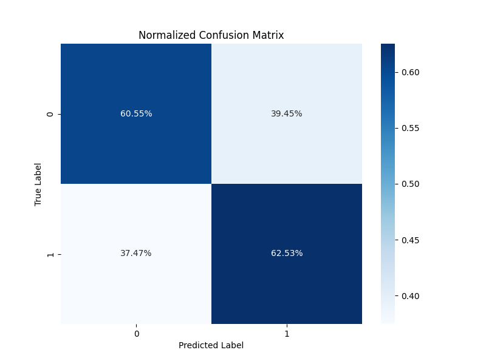
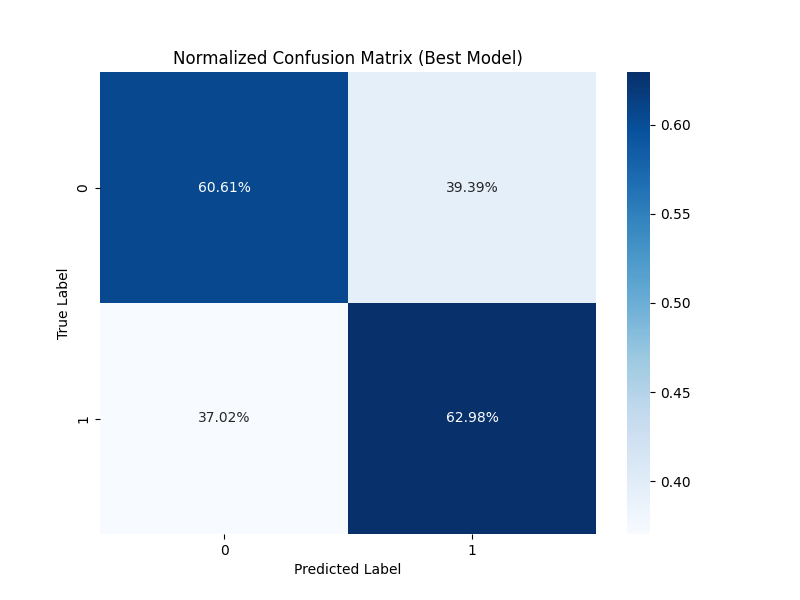
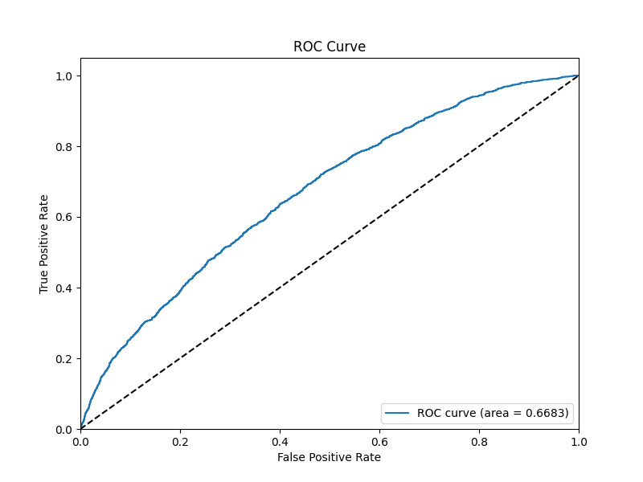
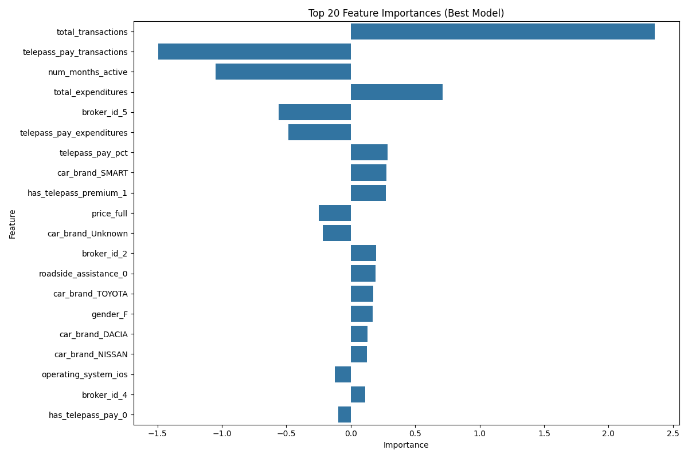

# Logistic Regression Model for Telepass Insurance Purchase Prediction

## 1. Approach in Building the Model

Our approach to building the Logistic Regression model involved several systematic steps:

### Data Preparation
- We merged transaction data with insurance quotes data using the customer ID as the common key
- We preprocessed the data by handling missing values, converting date fields, and standardizing numeric variables with comma separators

### Feature Engineering
We created several derived features to capture important aspects of customer behavior and characteristics:
- **Age-related features**: Customer age and car age at the time of policy quote
- **Membership features**: Telepass membership duration in years
- **Subscription features**: Flags for active TelepassPay and Telepass Premium subscriptions
- **Transaction features**: Total transactions, expenditures, average transaction value, number of months active
- **Service usage patterns**: Number of unique service types used, percentage of TelepassPay transactions

### Feature Selection
We selected a mix of customer demographic data, car characteristics, transaction behavior, and pricing information as predictors:
- **Numerical features**: Basic coverage, price information, transaction metrics, car age, membership duration
- **Categorical features**: Driving type, car brand, gender, operating system, broker ID, subscription status

### Modeling Decisions
- We chose Logistic Regression as our first model because of its interpretability and effectiveness for binary classification
- We implemented class balancing to handle the imbalanced nature of the dataset (72% non-purchases vs 28% purchases)
- We preprocessed features using a pipeline with standardization for numerical features and one-hot encoding for categorical features
- We used cross-validation to avoid overfitting and implemented hyperparameter tuning to optimize model performance

## 2. Model Performance and Limitations

### Performance Metrics
- **Accuracy**: 61.27% (after tuning)
- **Precision**: 38.29% (proportion of predicted purchases that were actual purchases)
- **Recall**: 62.98% (proportion of actual purchases that were correctly predicted)
- **F1 Score**: 47.63% (harmonic mean of precision and recall)
- **ROC AUC**: 66.97% (area under the ROC curve)

### Confusion Matrix (Base Model)

### Confusion Matrix (Optimized Model)

### ROC Curve

### Strengths
- The model successfully identifies many potential buyers (high recall)
- Good interpretability, providing clear insights into the factors influencing purchase decisions
- Computationally efficient, making it suitable for frequent retraining as new data becomes available

### Weaknesses and Limitations
1. **Limited precision**: The model has a relatively high false positive rate, predicting many non-buyers as buyers
2. **Linearity assumption**: Logistic regression assumes a linear relationship between features and log-odds of the target, which may not capture more complex relationships
3. **Data imbalance challenges**: Despite class balancing, the heavy imbalance (72% non-purchases) makes prediction more difficult
4. **Missing values**: Many important features had significant missing values, requiring imputation that may introduce bias
5. **Feature interaction limitations**: The model doesn't naturally capture interactions between features

## 3. Performance Metrics and Optimization Choices

### Performance Metrics Selection
We guided our optimization process using the following metrics:

1. **ROC AUC** (primary optimization metric): We chose this metric for hyperparameter tuning because:
   - It is insensitive to class imbalance
   - It evaluates model performance across all threshold values
   - It measures the model's ability to rank positive instances higher than negative ones

2. **Recall/Sensitivity**: Important as the business cost of missing a potential customer (false negative) is likely higher than incorrectly flagging a non-buyer (false positive)

3. **F1 Score**: Used to find the balance between precision and recall, especially important in an imbalanced dataset

### Optimization Decisions
1. **Hyperparameter Tuning**: We optimized:
   - Regularization strength (C): 0.1 was optimal, indicating some regularization was beneficial
   - Penalty type: L1 regularization performed best, suggesting feature selection was important
   - Solver: The 'liblinear' solver worked best for our dataset

2. **Class Weighting**: We implemented class weights to address the imbalanced distribution, giving higher weight to the minority class (insurance purchasers)

3. **Feature Selection**: Our approach to feature selection was guided by domain knowledge and feature importance analysis, focusing on transaction patterns and customer characteristics

## 4. Key Findings from Feature Importance Analysis

The model revealed several important patterns about what influences a customer's decision to purchase insurance:

### Feature Importance

1. **Transaction behavior is the strongest predictor**: The total number of transactions was the most influential feature, suggesting active Telepass users are more likely to purchase insurance. Specifically:
   - Higher transaction frequency strongly correlates with purchase likelihood
   - The number of months a customer has been active also significantly impacts purchase decisions

2. **Telepass subscription characteristics matter**: 
   - Having Telepass Premium increases purchase likelihood
   - Customers' relationship duration with Telepass influences their purchasing behavior

3. **Broker influence is significant**: Different brokers have varying success rates in converting quotes to purchases

4. **Car characteristics play a role**: Certain car brands show stronger correlation with purchase decisions

5. **Customer demographics have moderate influence**: Gender shows some predictive power, with male customers slightly more likely to purchase

## Conclusion

The Logistic Regression model provides a solid baseline for predicting insurance purchase decisions. While its overall accuracy is moderate (61%), it successfully identifies many potential buyers (63% recall) and provides valuable insights into customer behavior. 

The model's interpretability is particularly valuable for understanding the factors driving purchase decisions. The strongest predictors are transaction frequency, subscription characteristics, and broker relationships, highlighting that active engagement with Telepass services correlates with higher insurance purchase likelihood.

Key limitations include moderate precision and the inability to capture complex non-linear relationships. These limitations suggest that more sophisticated models like Decision Trees and Random Forests might improve predictive performance, which will be explored in subsequent analyses. 