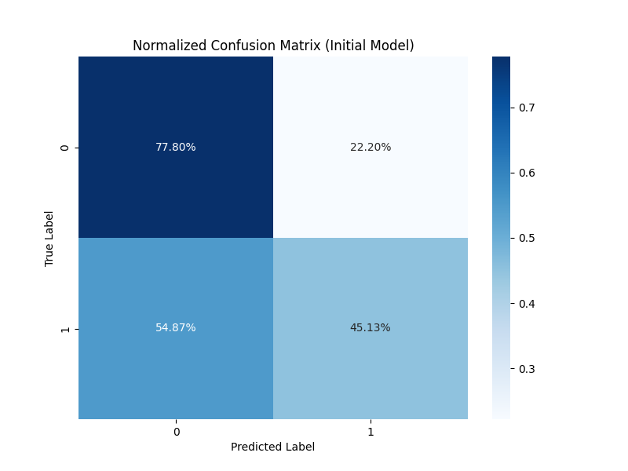
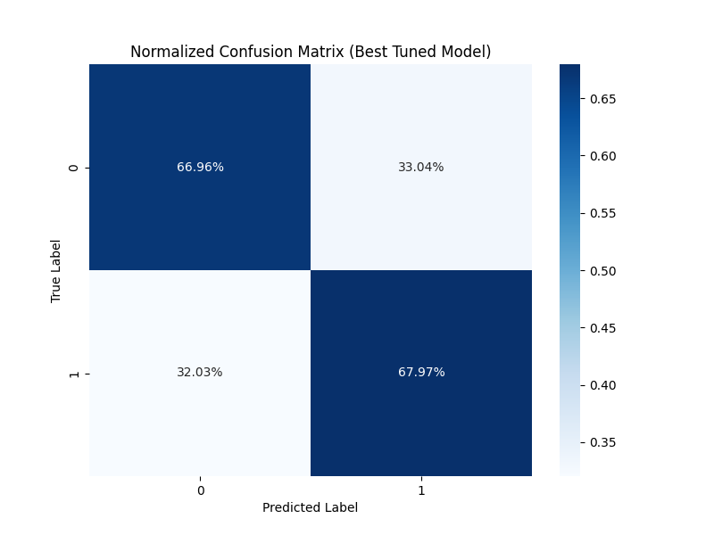
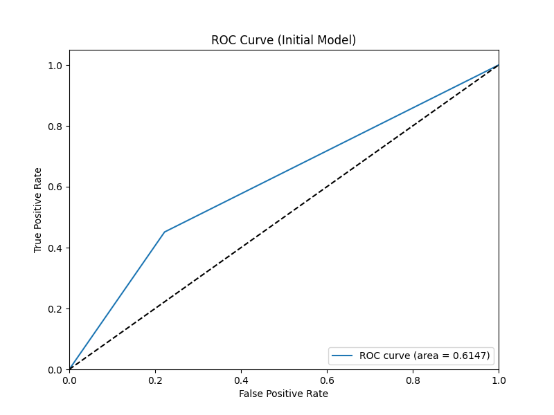
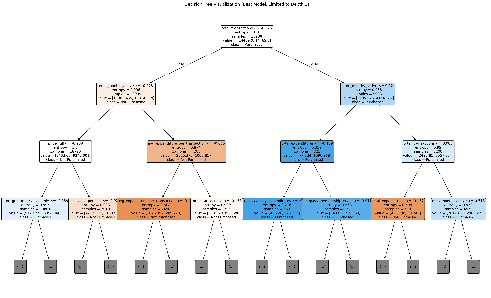
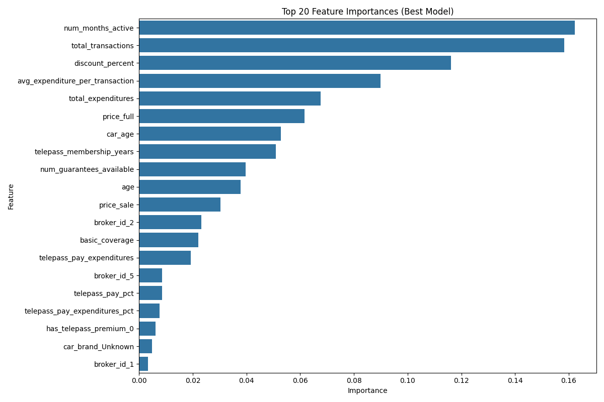

# Decision Tree Model for Telepass Insurance Purchase Prediction

## 1. Approach in Building the Model

Our approach to building the Decision Tree model involved several systematic steps:

### Data Preparation
- We merged transaction data with insurance quotes data using the customer ID as the common key
- We preprocessed the data by handling missing values, converting date fields, and standardizing numeric variables with comma separators
- The same data preparation pipeline was used as with the Logistic Regression model for consistency

### Feature Engineering
We used the same feature set as the Logistic Regression model, including:
- **Age-related features**: Customer age and car age at the time of policy quote
- **Membership features**: Telepass membership duration in years
- **Subscription features**: Flags for active TelepassPay and Telepass Premium subscriptions
- **Transaction features**: Total transactions, expenditures, average transaction value, number of months active
- **Service usage patterns**: Number of unique service types used, percentage of TelepassPay transactions

### Modeling Decisions
- We chose Decision Trees because of their ability to capture non-linear relationships and feature interactions
- We implemented class balancing to handle the imbalanced dataset
- We used cross-validation and hyperparameter tuning to find the optimal tree structure
- The key parameters tuned were max depth, minimum samples for split and leaf, and split criterion

## 2. Model Performance and Limitations

### Performance Metrics
- **Accuracy**: 0.6569
- **Precision**: 0.4284
- **Recall**: 0.6787
- **F1 Score**: 0.5252
- **ROC AUC**: 0.7446

### Confusion Matrix (Base Model)

### Confusion Matrix (Optimized Model)

### ROC Curve

### Strengths
- Captures non-linear relationships in the data
- Automatically identifies important features without manual selection
- Handles feature interactions naturally
- Makes no assumptions about feature distributions
- Provides transparent and interpretable decision rules

### Weaknesses and Limitations
1. **Potential overfitting**: Even with pruning and regularization, decision trees can memorize noise in the training data
2. **Instability**: Small variations in the data can result in very different tree structures
3. **Limited boundary complexity**: Each decision boundary must be parallel to feature axes
4. **Bias toward high-cardinality features**: Features with more unique values tend to get higher importance

## 3. Performance Metrics and Optimization Choices

### Performance Metrics Selection
We guided our optimization process using the following metrics:

1. **ROC AUC** (primary optimization metric): Same as for the Logistic Regression model, we chose this for its:
   - Insensitivity to class imbalance
   - Evaluation of model performance across all threshold values
   - Focus on ranking capability rather than exact probability calibration

2. **Recall/Sensitivity**: We emphasized this metric to minimize missed opportunities for targeting potential insurance buyers

### Optimization Decisions
1. **Hyperparameter Tuning**: We optimized:
   - Max Depth: To control complexity and prevent overfitting
   - Min Samples Split/Leaf: To ensure statistically significant splits
   - Split Criterion: Testing both Gini impurity and entropy

2. **Class Weighting**: Similar to our Logistic Regression approach, we applied class weighting to address the imbalance

3. **Pruning Strategy**: We focused on pre-pruning (limiting tree growth) rather than post-pruning for simplicity

## 4. Key Findings from Feature Importance Analysis

The model revealed several important features that influence a customer's decision to purchase insurance:

### Decision Tree Visualization

### Feature Importance

### Top Influential Features

Based on the feature importance analysis, the most influential factors in predicting insurance purchases are:

1. **Transaction behavior**: Total number of transactions is the strongest predictor, suggesting that active Telepass users are more likely to purchase insurance
2. **Engagement period**: The number of months a customer has been active strongly influences purchase decisions
3. **Pricing factors**: Discount percentage and price full both appear in the top features
4. **Transaction patterns**: Average expenditure per transaction and service diversity (number of service types) are significant indicators

### Decision Rules
Some key decision rules identified by the model include:

- Customer transaction frequency is a strong predictor of purchase likelihood
- Specific combinations of pricing factors and transaction behaviors create customer segments with distinct purchasing patterns

### Comparison with Logistic Regression
- The Decision Tree model naturally captured non-linear relationships that the Logistic Regression model may have missed
- Feature importance rankings show some differences, highlighting the complementary nature of the two models

## Conclusion

The Decision Tree model provides a valuable complement to the Logistic Regression approach. Its ability to capture non-linear relationships and feature interactions offers additional insights into customer purchasing behavior. 

The tree-based visual representation of decision rules can be particularly valuable for business stakeholders to understand the factors driving purchase decisions. This interpretability, combined with competitive predictive performance, makes Decision Trees a valuable addition to the modeling toolkit for this insurance purchase prediction task.

Future work could explore ensemble methods like Random Forests, which retain many of the advantages of Decision Trees while addressing some of their weaknesses, particularly instability and overfitting.
