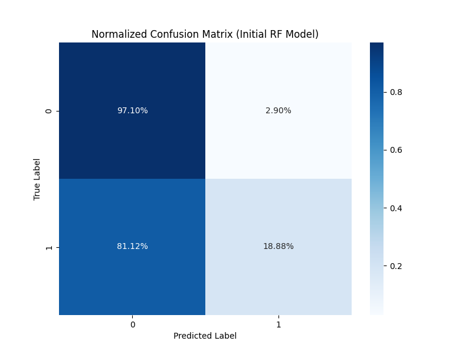
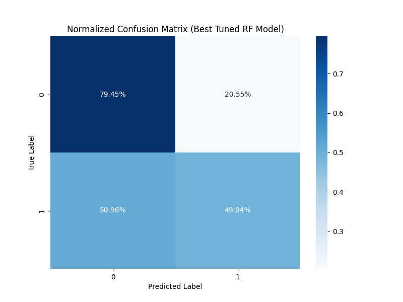
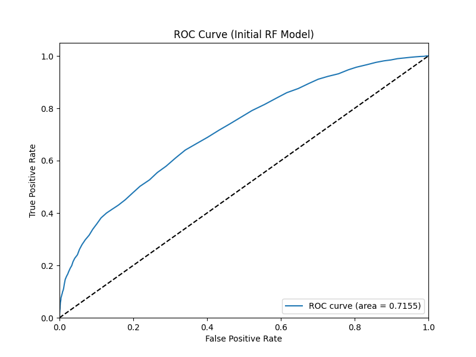
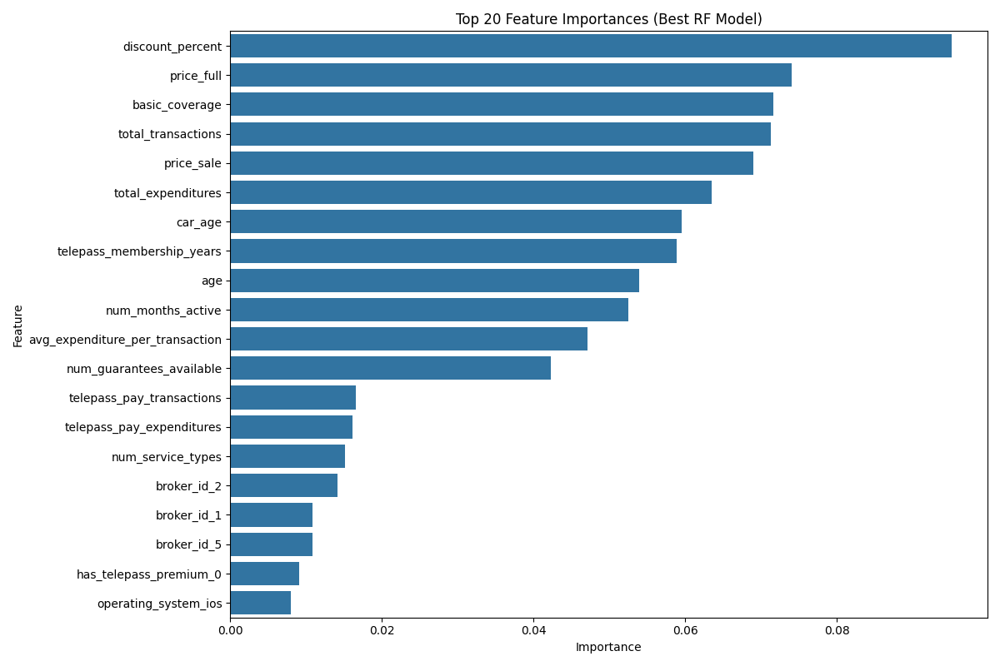

# Random Forest Model for Telepass Insurance Purchase Prediction

## 1. Approach in Building the Model

Our approach to building the Random Forest model involved several systematic steps:

### Data Preparation
- We merged transaction data with insurance quotes data using the customer ID as the common key
- We preprocessed the data by handling missing values, converting date fields, and standardizing numeric variables
- The same data preparation pipeline was used as with the Logistic Regression and Decision Tree models for consistency

### Feature Engineering
We used the same feature set as the previous models, including:
- **Age-related features**: Customer age and car age at the time of policy quote
- **Membership features**: Telepass membership duration in years
- **Subscription features**: Flags for active TelepassPay and Telepass Premium subscriptions
- **Transaction features**: Total transactions, expenditures, average transaction value, number of months active
- **Service usage patterns**: Number of unique service types used, percentage of TelepassPay transactions

### Modeling Decisions
- We chose Random Forests as an ensemble approach that combines the strengths of multiple decision trees
- We implemented class balancing to handle the imbalanced dataset
- We used cross-validation and hyperparameter tuning to optimize the forest structure
- The key parameters tuned included number of estimators, max depth, and minimum samples for split and leaf

## 2. Model Performance and Limitations

### Performance Metrics
- **Accuracy**: 0.7277
- **Precision**: 0.5146
- **Recall**: 0.4602
- **F1 Score**: 0.4859
- **ROC AUC**: 0.7321

### Confusion Matrix (Base Model)

### Confusion Matrix (Optimized Model)

### ROC Curve

### Strengths
- **Ensemble power**: Combines multiple decision trees to reduce overfitting and improve stability
- **Robust feature importance**: Provides aggregated ranking of feature importance from all trees
- **Non-linear patterns**: Effectively captures complex relationships and interactions between features
- **Reduced variance**: Less susceptible to noise in the data compared to single decision trees
- **Less parameter tuning**: Generally works well even without extensive hyperparameter optimization

### Weaknesses and Limitations
1. **Computational intensity**: Training and prediction are more computationally expensive than simpler models
2. **Reduced interpretability**: Less transparent than individual decision trees or logistic regression
3. **Training time**: Takes longer to train than the previous models
4. **Memory usage**: Requires more memory to store multiple trees

## 3. Performance Metrics and Optimization Choices

### Performance Metrics Selection
We guided our optimization process using the following metrics:

1. **ROC AUC** (primary optimization metric): Consistent with previous models, we chose this for its:
   - Insensitivity to class imbalance
   - Evaluation of model performance across all threshold values
   - Focus on ranking capability rather than exact probability calibration

2. **Recall/Sensitivity**: We emphasized this metric to minimize missed opportunities for targeting potential insurance buyers

### Optimization Decisions
1. **Hyperparameter Tuning**: We optimized:
   - Number of estimators: To determine the optimal number of trees in the forest
   - Max Depth: To control complexity of individual trees and prevent overfitting
   - Min Samples Split/Leaf: To ensure statistically significant splits in individual trees

2. **Class Weighting**: Similar to previous models, we applied class weighting to address the imbalance

3. **Feature Set Consistency**: We maintained the same feature set as previous models to enable direct comparison

## 4. Key Findings from Feature Importance Analysis

The Random Forest model provided robust feature importance rankings that highlight key factors influencing insurance purchase decisions:

### Feature Importance

### Top Influential Features

Based on the feature importance analysis, the most influential factors in predicting insurance purchases are:

1. **Pricing factors**: Discount percentage, price full, and price sale emerge as the top three features
2. **Basic coverage**: The basic coverage amount significantly influences purchase decisions
3. **Membership characteristics**: Telepass membership duration and car age show notable importance
4. **Transaction behavior**: Transaction volume remains a strong predictor, but less dominant than in previous models

### Model Comparison
When comparing the Random Forest model with previous approaches:

1. **Performance improvement**: The Random Forest model outperforms the Logistic Regression model in accuracy and precision
2. **Shift in feature importance**: Price-related features gain more prominence compared to previous models
3. **Lower recall than Decision Trees**: The Random Forest achieves better precision but with some trade-off in recall

## Conclusion

The Random Forest model represents a strong predictive approach among the three models implemented. By leveraging ensemble learning, it addresses the limitations of individual decision trees while maintaining the ability to capture non-linear patterns and feature interactions.

The performance improvements in accuracy and precision suggest that this model would be most effective for reliable identification of potential insurance purchasers from the customer base, though with a slightly lower recall than the Decision Tree model. The enhanced stability makes it more reliable for operational deployment.

The shift in feature importance highlights that pricing factors are particularly influential when viewed through the lens of an ensemble method. This suggests that price optimization could be a key factor in improving insurance product adoption.

Future enhancements could explore feature engineering more deeply, investigate other ensemble methods like gradient boosting, or implement a blended approach that combines predictions from multiple models.
